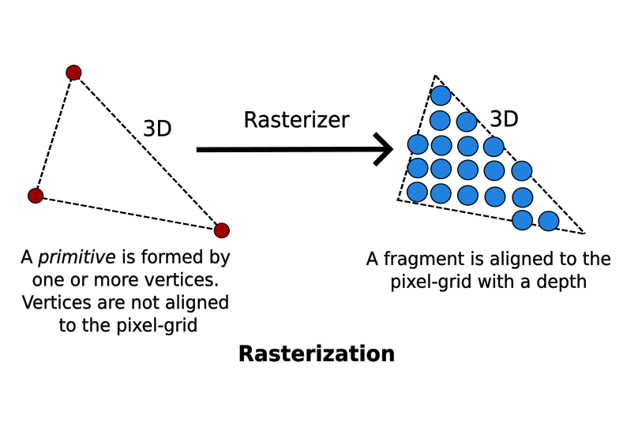

# 3D Graphics with OpenGL - Basic Theory
## 1. Computer Graphics Hardware
### 1.1 Diagram of Processing Graphics and Display Output
The process that graphics processing takes from the input to the output of the display.

### 1.2 Pixels and Frames 
All modern displays are raster-based. A **raster** is a 2D rectangular grid of pixels. The *color* and a *position* are the two properties of a pixel. The color is expressed in **RGB** (**Red-Green-Blue**) components; this is usually **true color**. **True color** means the color uses 24 bits per pixel. The position is described in (x, y) coordinates. The origin (0, 0) is located at the top-left corner, with x-axis pointing right and y-axis pointing down. This is different from the standard 2D *Cartesian coordinates*, where the y-axis is pointing upwards.

The **depth** of a display is the number of bits used to denote the color of a single pixel. The **resolution** of the display is the number of rows by column of the rectangular grid. 

#### 1.2.1 Why the Origin is at the Top Left?
Early computers had Cathode Ray Tubes (CRTs). CRTs *draw* the image with a cathode ray from the **top left** corner to the **lower right** corner. The memory was read from the *beginning* in order to ease the **interface** between the graphics card memory and the CRT. Image was drawn from the **top left** (with the lowest memory address) to the **lower right** (with the highest memory address).

### 1.3 Frame Buffer and Refresh Rate

The **frame buffer** is a special part of the graphics memory where the color values of the pixels are stored. The GPU writes the color value into the frame buffer. The **raster-scan** is where the display reads the color values from the frame buffer row-by-row, from left-to-right, top-to-bottom, and puts each of the values onto the screen. The **refresh rate** is where the display refreshes its screen several dozen times per second, typically 60Hz for LCD monitors and higher for CRT tubes.

A complete screen image is called a **frame**.

### 1.4 Double Buffering and VSync
While the display is reading from the frame buffer to display the current frame, we might be updating its contents for the next frame (not in a raster-scan matter). This would result in **tearing**.  **Tearing** is where the screen shows parts of the of the *old frame* and parts of the *new frame*.

This could be resolved by using **double buffering**. Instead of using a single frame buffer,  a modern GPU uses two of them. These are the **front buffer** and the **back buffer**. The display reads from the front buffer, while we can write the next frame to the back buffer. When we finish, we signal to the GPU to swap the front and back buffer. This is known as the **buffer swap** or **page flip**. 

Double buffering alone does not solve the entire problem, as the buffer swap might occur at an inappropriate time, for example, while the display is in the middle of displaying the old frame. This is resolved with **vertical synchronization** or **VSync** at the end of the raster-scan. When we signal the GPU to do a buffer swap, the GPU will wait till the next VSync to perform the actual swap, after the entire current frame is displayed.

The most important point is when the VSync buffer-swap is enabled, you can't refresh the display faster than the refresh rate of the display. For LCD/LED displays, the refresh rate is typically locked at 60Hz or 60 frames per second, or 16.7 milliseconds (1000/60 milliseconds) for each frame. 

## 2. 3D Graphics Rendering Pipeline
A **pipeline** refers to a series of processing stages in which the output from one stage is fed as the input of the next stage. With massive parallelism, the pipeline can massively improve the overall throughput. 

In computer graphics, **rendering** is the process of producing an image on the display from the model description. 

The *3D Graphics Rendering Pipeline* accepts description of 3D objects in terms of vertices of primitives (such as a triangle, point, line and quad), and produces the color-value for the pixels on the display.

The 3D graphics rendering pipeline consists of the following main stages:
1. **Vertex Processing**: Process and transform individual vertices.
2. **Rasterization**: Convert each primitive (connected vertices) into a set of fragments.
3. **Fragment Processing**: Process individual fragments.
4. **Output Merging**: Combine the fragments of all primitives (in 3D space) into 2D color-pixel for the display.

In a modern GPU, the *vertex processing stage* and *fragment processing stage* are programmable. You can write programs, known as the **vertex shader** and **fragment shader** to perform your custom transform for **vertices** and **fragments**. The shader programs are written in in a C-like high level languages such as GLSL (OpenGL Shading Language), HLSL (High-Level Shading Language for Microsoft Direct3D), or Cg (C for Graphics by NVIDIA).

However, *rasterization* and *output merging stages* are not programmable, but configurable via configuration commands issued by the GPU.

## 3. Vertices, Primitives, Fragment and Pixels
### 3.1 3D Graphics Coordinate Systems
OpenGL adopts the **Right-Hand Coordinate System** (**RHS**). RHS is counter-clockwise (CCW). The 3D Cartesian Coordinates is a RHS.

Some graphics software (such as Microsoft Direct3D) use **Left-hand System** (**LHS**), where the z-axis is inverted. LHS is clockwise (CW).

### 3.2 Primitives
The inputs to the Graphics Rendering Pipeline are geometric **primitives** (such as triangle, point, line or quad), which is formed by one or more vertices. 

OpenGL supports three classes of geometric primitives: **points**, **line segments**, and **closed polygons**. They are specified via vertices. Each vertex is associated with its attribute such as position, color, normal and texture. OpenGL provides 10 primitives. The sphere, 3D box and pyramid are not primitives. They are typically assembled using primitive **triangle** or **quad**.

The Core OpenGL models an object via geometric primitives such as a **point**, **line**, and **polygon**.

OpenGL Primitives:
1. GL_POINTS
2. GL_LINES
3. GL_LINE_STRIP
4. GL_LINE_LOOP
5. GL_POLYGON
6. GL_TRIANGLES
7. GL_TRIANGLE_STRIP
8. GL_TRIANGLE_FAN
9. GL_QUADS
10. GL_QUAD_STRIP

Diagram of some of the OpenGL Primitives:

### 3.3 Vertices
A **vertex**, in computer graphics has these attributes:
1. **Position in 3D space** V=(x, y, z): typically expressed in floating point numbers.
2. **Color**: expressed in RGB (Red-Green-Blue) or RGBA (Red-Green-Blue-Alpha) components. The component values are typically normalized to the range of 0.0 and 1.0 (or 8-but unsigned integer between 0 and 255). Alpha is used to specify the transparency.
3. **Vertex-Normal** N=(nx, ny, nz): We are familiar with the concept of surface normal, where the normal vector is perpendicular to the surface. However in computer graphics, we need to attach a normal vector to each vertex, known as **vertex-normal**. Normals are used to differentiate the front-face and back-face, and for other processing such as lighting. Right-hand rule (or counter-clockwise) is used in OpenGL. The normal is pointing outwards, indicating the outer surface (or front-face).
4. **Texture** T=(s, t): In computer graphics, we often wrap a 2D image to an object to make it seem realistic. A vertex could have a 2D texture coordinates (s, t), which provides a reference point to a 2D texture image.
5. Others.

### 3.4 Pixel vs. Fragment

**Pixels** refers to the dots on the display, which are aligned in a 2-dimensional grid of rows and columns corresponding to the display's resolution. A pixel is 2-dimensional, with a (x, y) position and RGB color value (there is no alpha value for pixels). The purpose of the **Graphics Rendering Pipeline** is to produce the color-value for all the pixels for displaying on the screen, given the input primitives.

In order to produce the grid-aligned pixels for the display, the **rasterizer** of the graphics rendering pipeline takes each input primitive and performs *raster-scan* to produce a set of grid-aligned fragments enclosed within the primitive. A fragment is 3-dimensional, with a (x, y, z) position. The (x, y) are aligned with the 2D pixel-grid. The *z-value* (not grid-aligned) denotes its depth. The z-values are needed to capture the relative depth of various primitives, so that obstructed objects can be discarded (or the alpha channel of transparent objects processed) in the *output-merging stage*. 

**Fragments** are produced via *interpolation* of the vertices, Hence, a fragment has all the vertex's attributes such as color, fragment-normal and texture coordinates. 

In a modern GPU, **vertex** processing and **fragment** processing are programmable. The programs are called **vertex shader** and **fragment shader**.

## 4. Vertex Processing
### 4.1  Coordinates Transformation
The process used to produce a 3D scene on the display in computer graphics is like taking a photograph with a camera. It involves four transformations:
1. Arrange the objects (or models, or avatar) in the world (Model Transformation or World transformation).
2. Position and orientation of the camera (View transformation).
3. Select a camera lens (wide angle, normal, or telescopic), adjust the focus length and zoom factor to set the camera's field of view (*Projection transformation*).
4. Print the photo on a selected area of the paper (*Viewport transformation*) in the *rasterization stage*

A transform converts a vertex V from one space (or coordinate system) to another space V'. In computer graphics, transform is carried by multiplying the vector with a *transformation matrix*, ex: **V' = MV**.

### 4.2 Projection Transform - Perspective Projection
#### 4.2.1 Clipping-Volume Cuboid
A **Cuboid** is a convex polyhedron surrounded by 6 rectangular faces with 8 vertices and 12 edges. The **volume of the cuboid** is the space occupied in 3D space. **Clipping volumes** define the present volumes of space used for timely filtering of any data for visualization purposes. 

Apply a projection matrix to transform the view-frustum into a axis-aligned **cuboid clipping-volume** of 2x2x1 centered on the near plane.

### 4.3 Outputs of the Vertex Processing Stage
Each vertex is transformed and positioned in the *clipping volume cuboid* space, together with their vertex-normal. The x and y coordinates (in the range of -1 to +1) represent its position on the screen, and the z value (in the range of 0 to 1) represents its depth, ex: how far away from the near plane. 

The **vertex processing stage** transforms individual vertices. The relationships between vertices (ex: primitives) are not considered in this stage.

## 5. Rasterization
In the previous *vertex processing stage*, the vertices, which is usually represented in a float value, are not necessarily aligned with the pixel-grid of the display. The relationship of vertices, in terms of primitives, are also not considered.

In this **rasterization** stage, each primitive (such as triangle, quad, point, and line), which is defined by one or more vertices, are *raster-scan* to obtain a set of fragments enclosed within the primitive. Fragments can be treated as 3D pixels, which are aligned with the pixel-grid. The 2D pixels have a position and a RGB color value. The 3D fragments, which are *interpolated* from the vertices, have the same set of attributes as the vertices, such as position, color, normal, and texture.

The substages of **rasterization** include viewport transform, clipping, perspective, division, back-face culling, and scan conversion. The **rasterizer** is not programmable, but configurable via the directives.
### 5.1 Viewport Transform

#### 5.1.1 Viewport
**Viewport** is a *rectangular display area* on the application window, which is measured in screen's coordinates (in pixels, with origin at the top-left corner). A viewport defines the size and shape of the display area to map the projected scene captured by the camera onto the application window. It may or may not occupy the entire screen.

In 3D graphics, a **viewport** is a 3-dimensional to support z-ordering. which is needed for situations such as ordering of overlapping windows. 

#### 5.1.2 Viewport Transform
The final transform, *viewport transform*, maps the clipping volume (2x2x1 cuboid) to the 3D viewport, as shown below.

## 6. Fragment Processing
After rasterization, we have a set of **fragments** for each primitive. A **fragment** has a position, which is aligned to the pixel-grid. It has a depth, color, normal and texture coordinates, which are interpolated from the vertices. 

The **fragment processing** focuses on the *texture* and *lighting*, which has the greatest impact on the quality of the final image. 

The operations involved in the **fragment processor** are:
1. The first operation in fragment processing is texturing.
2. Next, primary and secondary colors are combined, and fog calculation may be applied.
3. The optional scissor test, alpha test, stencil test, and depth-buffer test are carried out, if enabled.
4. Then, the optional blending, dithering, logical operation, and bitmasking may be performed.

## 7. Output Merging
### 7.1 Z-Buffer and Hidden-Surface Removal
The **z-buffer** (or **depth-buffer**) can be used to remove hidden surfaces. **Hidden surfaces** are surfaces blocked by other surfaces that can't be seen from the camera. The z-buffer of the screen is initialized to 1 (farthest) and the color-buffer initialized to the background color. For each fragment of each primitive processed, its z-value is checked against the buffer value. If its z-value is smaller than the z-buffer, its  color and z-value are coped into the buffer. Otherwise, this fragment is obstructed by another object and discarded. The fragments can be processed in any order, in this algorithm.

## 8. Lighting
**Lighting** is the handling of interaction between the light sources and the objects in the 3D scene. Lighting is one of the most important aspect of producing a realistic scene.

The color we see in the real world is the result of the interaction between the light sources and the color material surfaces. In other words, the *viewer*, *light sources*, and the *material* are the three parties involved. When light (of a certain spectrum) from a light source strikes a surface, some gets absorbed, some is reflected or scattered. In a 2D phograph or painting, **shades** are objects that appear to be three-demensional due to some small variations in colors.  

There are two classes of lighting models:
1. **Local illumination**: consider only the direct lightings. The color of the surface depends on the reflectance properties of the surface and the direct lightings.
2. **Global illumination**: in the real world, objects received indirect lighting reflected from other objects and the environment. The global illumination model considers indirect lightings reflected from other obects in the scene. Global illumination is complex and computaional intensive. 

### 8.1 Vertex and Fragment Shaders
The **vertex shader** are shader programs that modify the geometry of the primitive. The **fragment shader** are shader programs that modify the color for each pixel of the primitive.

## 9. Resources
- [3D Graphics with OpenGL Basic Theory](https://www3.ntu.edu.sg/home/ehchua/programming/opengl/CG_BasicsTheory.html)
- [Section 2.1 - Pixels, Coordinates, and Colors](https://math.hws.edu/graphicsbook/c2/s1.html)
- [Why is the origin in computer graphics coordinates at the top left? - Stack Exchange](https://gamedev.stackexchange.com/questions/83570/why-is-the-origin-in-computer-graphics-coordinates-at-the-top-left#83571)
- [Vertex and Fragment Shader Examples - Unity Documentation](https://docs.unity3d.com/510/Documentation/Manual/SL-VertexFragmentShaderExamples.html#:~:text=The%20difference%20between%20vertex%20and,the%20color%20for%20each%20pixel.)
- [Vertex shader vs Fragment Shader [duplicate] - Stack Overflow](https://stackoverflow.com/questions/4421261/vertex-shader-vs-fragment-shader)
- [ARKit Theory: Vertices, Metal Shaders, UV Mapping and SCNProgram’s.](https://www.delasign.com/blog/arkittheoryverticesandshaders/)
- [Vertex Processing - Explaining basic 3D theory - MDN Web Docs](https://developer.mozilla.org/en-US/docs/Games/Techniques/3D_on_the_web/Basic_theory#vertex_processing)
- [Volume of Cuboid - Formula and Examples - GeeksforGeeks](https://www.geeksforgeeks.org/volume-of-cuboid/)
- [Clipping Volume](https://mxrap.com/dev_docs/ClippingVolume.html#:~:text=Clipping%20Volumes%20define%20present%20volumes,be%20anything%20the%20user%20desires.)
- [OpenGL Tutorial An Introduction on OpenGL with 2D Graphics](https://www3.ntu.edu.sg/home/ehchua/Programming/opengl/CG_Introduction.html)

### 9.1 Credit to Chua Hock-Chuan
The content based on the [3D Graphics with OpenGL Basic Theory](https://www3.ntu.edu.sg/home/ehchua/programming/opengl/CG_BasicsTheory.html) article by **Chua Hock-Chuan** of the *Nanyang Technology University of Singapore*. The content is a heavily simplified version of his article in order to make it approachable for new graphics programmers. Thanks to **Chua Hock-Chuan** for providing this content.

I would be promoting Chua Hock-Chuan's [programming notes](https://www3.ntu.edu.sg/home/ehchua/programming/index.html) if you are interested.
